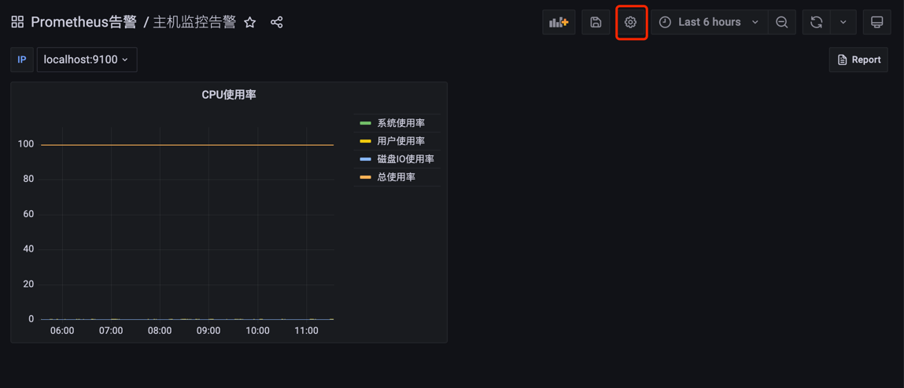
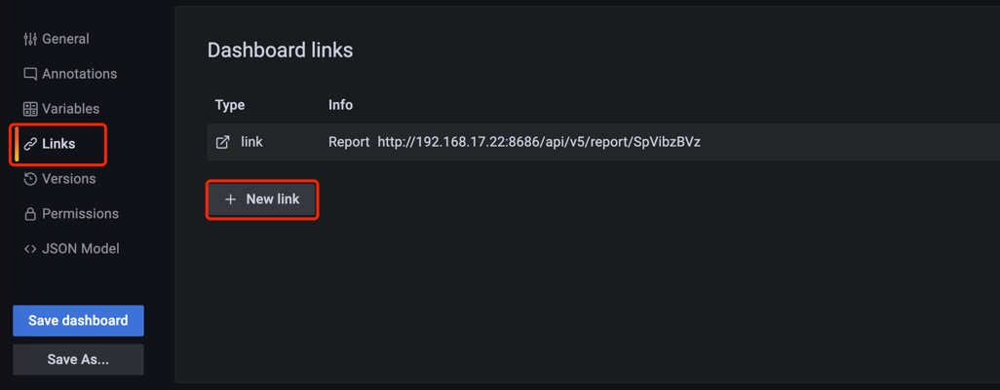
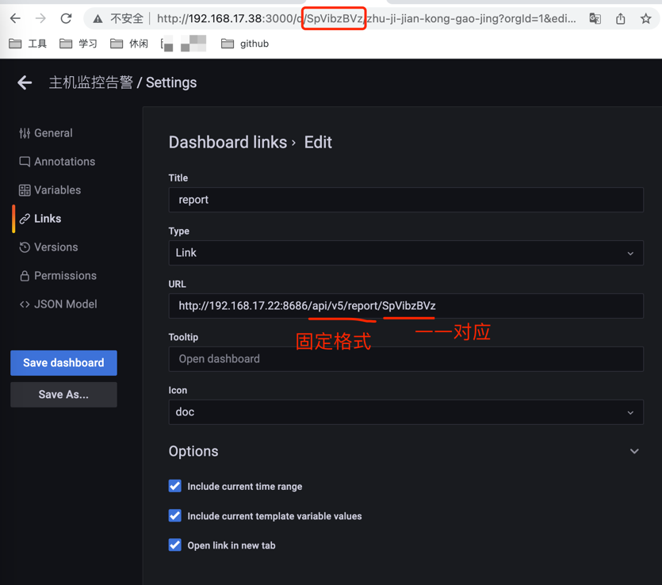
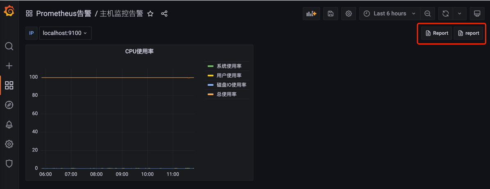

### 如何使用
**开源的Grafana-Report使用的是1.14版本，用的dep包管理工具，跟go mod不同，所以写此文档特作记录**

**测试时使用的Centos7.9执行源码发现有中文乱码，需要对开源代码进行修改**

**[修改方法摘抄博客](https://blog.csdn.net/shen12138/article/details/110533428)**

**[开源项目](https://github.com/IzakMarais/reporter)**
#### 适配中文
```
### 1、修改 report/report.go，225行和234行内容，把pdflatex换成xelatex
//225行
cmdPre := exec.Command("xelatex", "-halt-on-error", reportTexFile)
//234行
cmd := exec.Command("xelatex", "-halt-on-error", reportTexFile)

### 2、report/texTemplate.go 在const defaultTemplate中新增两行
\usepackage{xeCJK}
\setCJKmonofont{KaiTi}

### 3、默认点击下载是unicode码文件名称cmd/grafana-reporter/handler.go 引用bytes模块，新增函数conv_str，修改addFilenameHeader函数
func conv_str(filename string)string {
        buf := bytes.NewBuffer(nil)

        i, j := 0, len(filename)
        for i < j {
                x := i + 6
                if x > j {
                        buf.WriteString(filename[i:])
                        break
                }
                if filename[i] == '\\' && filename[i+1] == 'u' {
                        hex := filename[i+2 : x]
                        //fmt.Println(hex)
                        r, err := strconv.ParseUint(hex, 16, 64)
                        if err == nil {
                                //fmt.Println(string(r))
                                buf.WriteRune(rune(r))
                        } else {
                                buf.WriteString(filename[i:x])
                        }
                        i = x
                } else {
                        buf.WriteByte(filename[i])
                        i++
                }
        }
        //fmt.Println(buf.String())
        return buf.String()
}

### 4、修改addFilenameHeader函数转换名称
filename = conv_str(filename)
```

#### 构建项目
**因为不会mac下使用dep模式，所以选择到linux下构建**
```
### 1、安装go 1.14.7版本，因为开源代码使用的就是这个版本

### 2、创建文件夹 /root/go/src、/usr/local/go/src/github.com/IzakMarais/
mkdir -p /root/go/src
mkdir -p /usr/local/go/src/github.com/IzakMarais/

### 3、复制项目到两个目录下
cp -rf reporter /root/go/src
cp -rf reporter /usr/local/go/src/github.com/IzakMarais/

### 4、cd到/root/go/src下执行构建
cd /root/go/src/
go install -v reporter/cmd/grafana-reporter/

### 5、此时构建完成的二进制文件在 /root/go/bin/ 下
ls /root/go/bin/

### 6、启动服务，服务启动默认读取localhost grafana，如需修改 -h 查看参数
./grafana-reporter

```

#### 测试grafana使用reporter
**进入大屏点击设置，设置links**



**设置Titile、URL、ICON后会在页面显示**


#### 点击ICON后会跳转到reporter页面
**如果使用了加密需要设置api key，并且手动修改请求头**

`http://192.168.17.22:8686/api/v5/report/SpVibzBVz?from=now-6h&to=now&var-instance=localhost:9100`

**SpVibzBVz后面添加query，apitoken=${apiKey}，并且每个query后面需要添加 & 符号，修改为**

`http://192.168.17.22:8686/api/v5/report/SpVibzBVz?apitoken=eyJrIjoiQUtzVkNpTHNDR3RPM05tWk5jcG9DVlRPcFB5VjdSZ1MiLCJuIjoic2EiLCJpZCI6MX0=&from=now-6h&to=now&var-instance=localhost:9100`

#### 此时会出现 xelatex 错误，需要安装汉化包
```
### 1、安装汉化包
yum install -y atk at-spi2-atk libappindicator-gtk3 liberation-fonts texlive-latex-bin texlive-xetex-bin texmaker

### 2、安装字体
### 字体包在项目同级目录下
cp -rf xecjk/* /usr/share/texlive/texmf-dist/tex/xelatex/xecjk/
cp -rf euenc/* /usr/share/texlive/texmf-dist/tex/latex/euenc/
cp SIMKAI.ttf /usr/share/fonts/dejavu/
### 3、重新加载
texhash
```